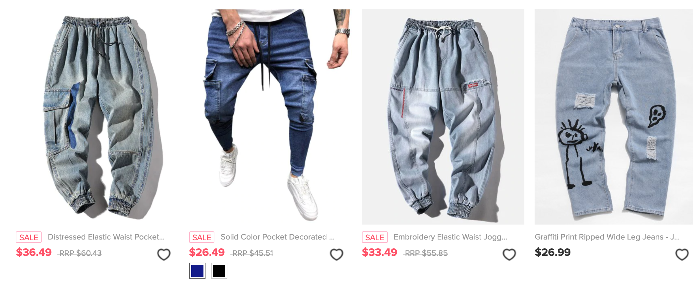

# Challenge 2 - Let's Create Some Cards

## Challenge Scope

This challenge will be occurring on July 3rd, 9am - 2:30pm. If you're coming here after the fact, check out people's buttons at the bottom of this readme. Let's build some cards in React!


Cards are used in various places. You might be familiar with cards if you ever shopped online and looked through a catalogue. When we say cards, we're really saying any container of information with similar structured items arranged in a row, column or grid. Saying 'cards' is easier than 'containers of information', so we'll stick with the term cards.



This is a great opportunity to stretch your React muscles. React is all about Components/Composition, and a Card is a perfect candidate to get into the React mindset. Generally the flow of creating cards through React is as follows:

- Create or Find a source of data that contains the UNIT of information you want. For clothing this might mean your data is an array of objects describing a clothing item (name, price, description etc.), and each object has the same keys. **The boilerplate code has an example data source in data.js**.

```javascript
export const boilerPlateData = [
  {
    id: 1,
    name: "Toothpaste",
    price: 4.44,
    description: "Fluoride-Flavored Toothpaste, Yum!"
  },
  {
    id: 2,
    name: "Baseball",
    price: 7.32,
    description: "Do not combine with window!"
  },
  {
    id: 3,
    name: "Sunglasses",
    price: 65.0,
    description: "What is the sun? I don't know."
  }
];
```

- Map over the source of data, and take the data in each item and turn them into JSX elements (or a whole other component). **We provided a simple example of this in App.js.**

```javascript
import React from "react";
import { boilerPlateData } from "./data.js";

export default () => {
  const generateCardsFromData = collection => {
    return collection.map(item => {
      return (
        <div key={item.id}>
          <h2>{item.name}</h2>
          <h4>{item.price}</h4>
          <p>{item.description}</p>
        </div>
      );
    });
  };

  return <>{generateCardsFromData(boilerPlateData)}</>;
};
```

# How To Use This Repo

Feel free to use this repository as a starting point, or create your own! We'll be posting links to the repositories of all the participants Cards below, so definitely come back again after the event is complete to see what other people have built!

If you do use this repo, simple add your components in `./src/components` and use `npm start` to view your development build using port 1234.

Thanks for reading, participating, and we can't wait to see what you build!
